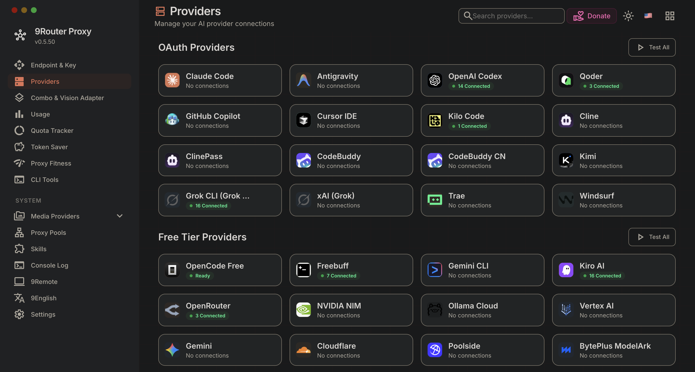
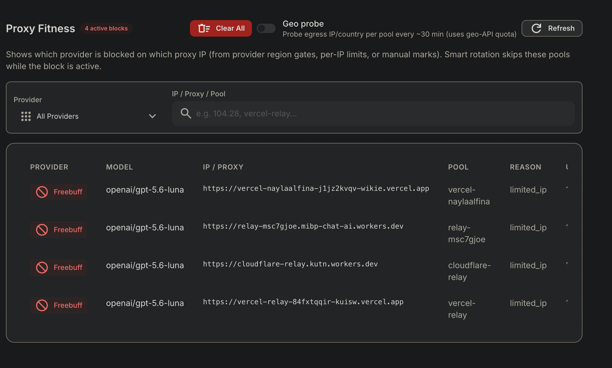
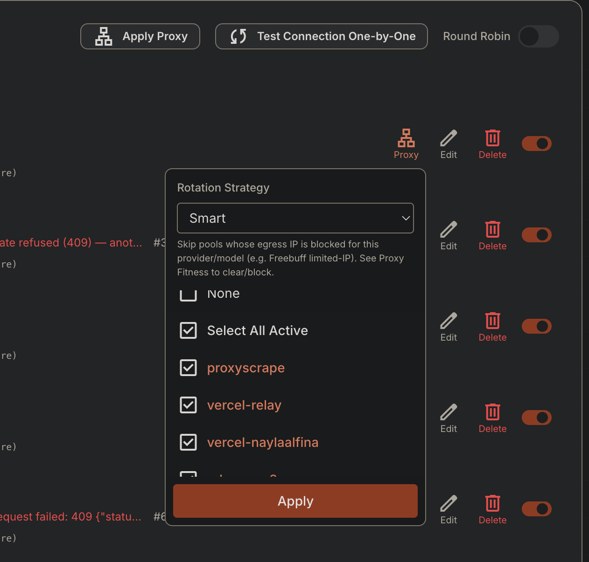

# 9Router - FREE AI Router & Token Saver

9Router is a local AI routing gateway with provider fallback and token-saving features.



## New Features

### Proxy Fitness

Monitor proxy health and egress location to keep routed requests reliable.



### Smart Rotation

Automatically rotate proxy pools and provider connections for better availability.



## Installation for Beginners

The easiest installation method is Docker. Docker runs 9Router in a container, so you do not need to install Node.js, npm, or the application dependencies manually.

### 1. Install Docker

Install Docker Desktop on Windows or macOS, or install Docker Engine and Docker Compose on Linux:

- [Docker Desktop](https://www.docker.com/products/docker-desktop/)
- [Docker Engine for Linux](https://docs.docker.com/engine/install/)

After installation, open a terminal and check that Docker is available:

```bash
docker --version
docker compose version
```

Both commands should print a version number.

### 2. Download the project

Clone this repository, then enter its folder:

```bash
git clone https://github.com/mhiqrambg/9router-mibp-version.git
cd 9router-mibp-version
```

If Git is not installed, download the repository as a ZIP file from GitHub and open the extracted folder in a terminal.

### 3. Create the environment file

Create `.env` from the example file:

```bash
cp .env.example .env
```

Open `.env` in a text editor and change at least these values:

```env
JWT_SECRET=replace-with-a-long-random-secret
INITIAL_PASSWORD=replace-with-your-dashboard-password
API_KEY_SECRET=replace-with-another-long-random-secret
MACHINE_ID_SALT=replace-with-another-random-secret
REQUIRE_API_KEY=true
```

Do not share `.env` or commit it to Git. It contains the dashboard password and security secrets. On Linux or macOS, you can generate random values with:

```bash
openssl rand -hex 32
```

Use a different generated value for each secret.

### 4. Start 9Router

Run this command in the project folder:

```bash
docker compose up -d
```

The first run downloads the 9Router and Headroom images. The `-d` option keeps them running in the background.

Check the containers:

```bash
docker compose ps
```

Both `9router` and `headroom` should have a running status.

### 5. Open the dashboard

Open this address in your browser:

```text
http://localhost:20128/dashboard
```

Log in with the `INITIAL_PASSWORD` value from `.env`.

### 6. Create an API key

In the dashboard, open **Endpoint & Key** and create a key. Keep the complete key that starts with `sk-`.

Use it when calling the API:

```bash
curl http://localhost:20128/v1/models \
  -H "Authorization: Bearer YOUR_API_KEY"
```

For a server exposed through a domain, replace the URL with your domain:

```bash
curl https://your-domain.example/v1/models \
  -H "Authorization: Bearer YOUR_API_KEY"
```

Remote requests without a valid API key are rejected. The API key is stored in the application database, not in `.env`.

### Useful Docker commands

View live logs:

```bash
docker compose logs -f 9router
```

Restart the application:

```bash
docker compose restart 9router
```

Stop the services without deleting data:

```bash
docker compose down
```

Update to the latest image:

```bash
docker compose pull
docker compose up -d
```

The Docker volume named `9router-data` keeps your settings, providers, and API keys when the container is recreated.

### Install from source

This option is intended for development. Install Node.js 22 or newer, then run:

```bash
cp .env.example .env
npm install
PORT=20128 NEXT_PUBLIC_BASE_URL=http://localhost:20128 npm run dev
```

Open `http://localhost:20128/dashboard` after the development server starts.

### Update

This fork follows `decolua/9router` through the `upstream` remote.

```bash
git fetch upstream
git checkout master
git merge upstream/master
git push origin master
```

To build and publish this fork's Docker image after updating the source:

```bash
git tag v1.0.0
git push origin v1.0.0
```

The GitHub Actions workflow builds and publishes:

```text
mhiqrambhrng/9router-mibp-version
```

On the server, update the running container with:

```bash
docker compose pull 9router
docker compose up -d
```

## Forks (9Router)

- [9Router upstream](https://github.com/decolua/9router)
- [9Router MIBP Version](https://github.com/mhiqrambg/9router-mibp-version)

## License

MIT License. See [LICENSE](LICENSE) for details.
